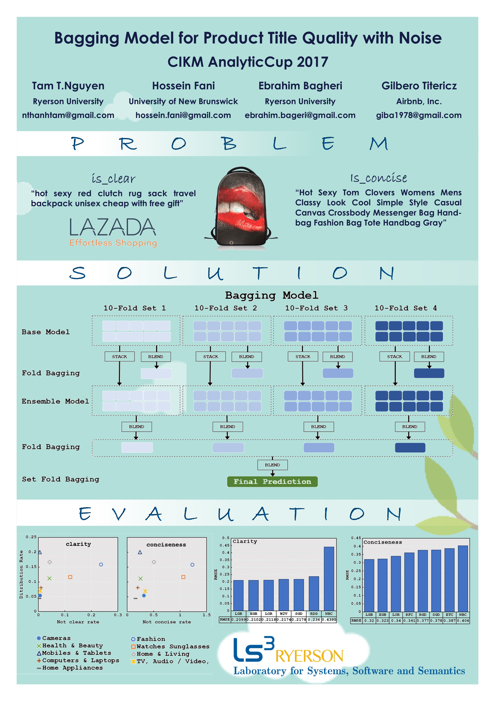

    Winning approach for the Lazada Product Title Quality Challenge for the CIKM Cup 2017 where the data set was annotated as conciseness and clarity. 
As sellers could freely enter anything for title and description, they might contain typos or misspelling words. Moreover, there were many annotators labelling the data so there must be disagreement on the true label of an SKU. 
This makes the problem difficult to solve if one is solely using traditional natural language processing and machine learning techniques. In our proposed approach, we adapted text mining and machine learning methods which take into account both feature and label noises. 

[Report](Report.pdf)

*KEYWORDS: Product Title Quality, E-Commerce, CIKM AnalytiCup 2017*

    

## License
©2021. This work is licensed under a [CC BY-NC-SA 4.0](LICENSE.txt) license. 
